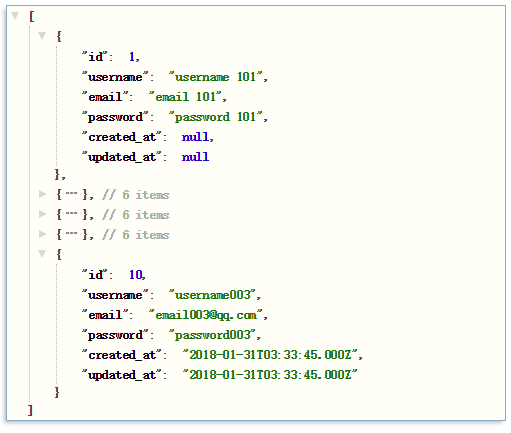

### Adonis.js Version
```bash
adonis v4.0
```
### Module List

1. Bodyparser
2. Session
3. Authentication
4. Web security middleware
5. CORS
6. Edge template engine
7. Lucid ORM
8. Migrations and seeds

### Minimum Required Versions.
```bash
Node.js 8.0 or greater.
Npm 3.0 or greater.
```

### Cli tool
```bash
npm i -g @adonisjs/cli
```

### Setup

Use the adonis command to install the blueprint

```bash
adonis new blog
```

or manually clone the repo and then run `npm install`.

### Mysql Schema
> mysql config path --> blog/.env <br>
mysql config path --> blog/config/database.js
```bash
# database/migrations/1503248427885_user.js
# database/migrations/1503248427886_token.js

adonis migration:run
```
```bash
# Desktop\blog>adonis migration:run
# bash Output:

migrate: 1503248427885_user.js
migrate: 1503248427886_token.js
Database migrated successfully in 341 ms
```

### Start Server

```bash
adonis serve --dev
```

### Demo
```bash
Desktop\blog>adonis make:view home
√ create  resources\views\home.edge

Desktop\blog>adonis make:controller home
? Select controller type For HTTP requests
√ create  app\Controllers\Http\HomeController.js
```
> Demo3 http://localhost:3333/home?id=123

### Extend
add data
> Demo4 http://localhost:3333/add

show data
> Demo5 http://localhost:3333/list


